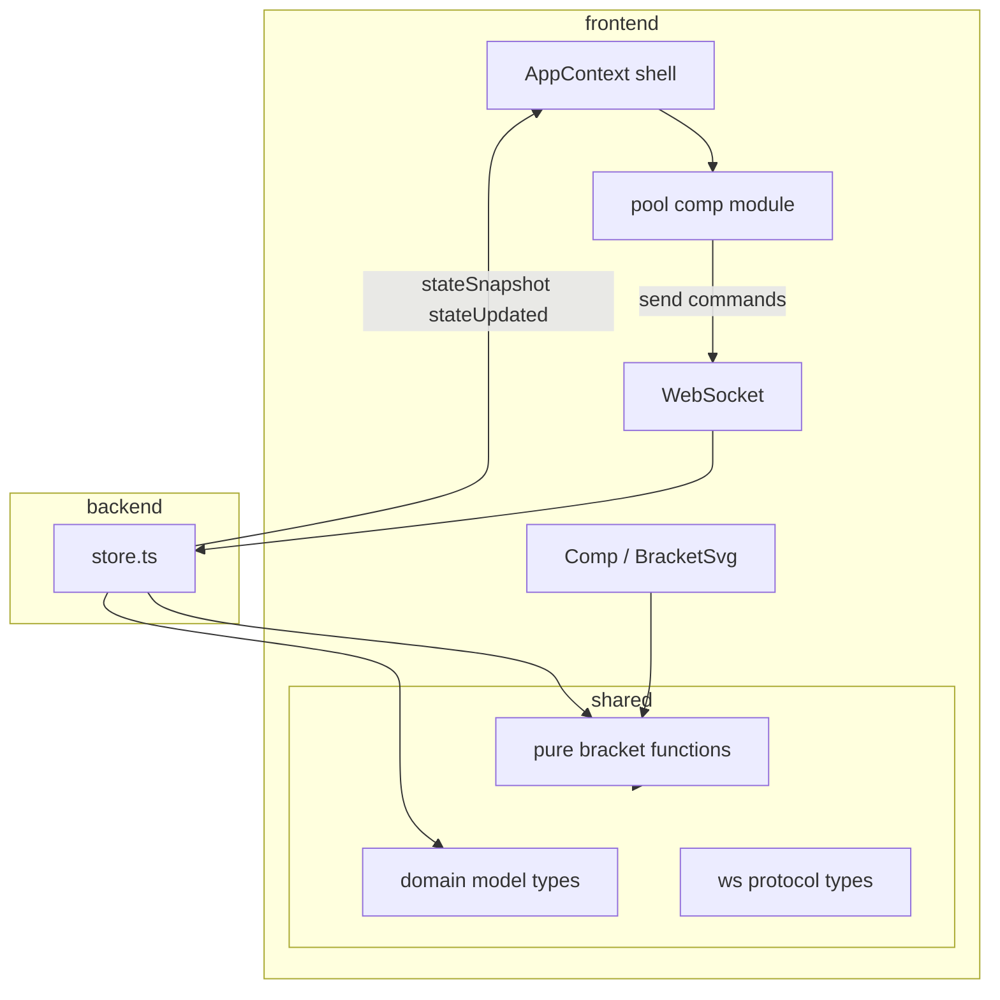

**Plans vs docs:** This file is an **implementation plan and todo list**, not product documentation. For the agreed **frontend / backend / `shared/` strategy** and data flow, see [`docs/frontend-backend-architecture.md`](../../docs/frontend-backend-architecture.md).

# Pool comp service, root `shared/` package, and fair first-round layout

## Architecture: who owns business logic?

**Preferred pattern (pragmatic for this app): the backend owns authoritative business logic; the frontend sends commands and renders replicated state.**

Reasons experienced teams usually favor this for apps like yours:

- **Single source of truth** — Random bracket placement, validation, and transitions happen once; every client sees the same result after `stateUpdated`.
- **Persistence** — The server (or sheet-backed repo) already persists; computing “official” layout only on the client would either duplicate logic or invite drift.
- **Cheating / mistakes** — A malicious or buggy client cannot invent a favorable bracket; the server decides what “start comp” means.
- **Reconnects** — UI rebuilds from snapshots; no reliance on client-only ephemeral calculations.

The frontend still needs **pure helpers** for things that are deterministic from current state (e.g. **setup** bracket preview: sequential fill) and for **tests**. Those helpers live in **`shared/`** (same module the backend uses) so there is **one implementation** of bracket math—not a second copy under `frontend/src`.

**What the frontend pool comp module is responsible for:** wrapping `send(...)` for pool-comp commands (`createPoolComp`, `startActivePoolComp`, etc.), and exposing any UI-facing helpers that call **`shared/`** pure functions. It is **not** responsible for computing the official post-start bracket and pushing a finished structure to the server unless you later add an explicit admin-only API (you are not doing that here).

## Root `shared/` folder (sibling to `frontend/` and `backend/`)

**Naming:** **`shared/`** is the conventional, easy-to-grok name for “TypeScript the client and server both import.” That naturally includes **WebSocket command and message types** (transport contract) and **domain model types** (`PoolComp`, snapshot shapes)—they are all part of one **shared kernel**, not random duplicate structs in `frontend/` and `backend/`. Pure bracket rules live here too so preview and server use the **same** code.

Suggested layout (flat files or subfolders—keep the rule “nothing cross-app lives only in fe/be”):

- **WebSocket / wire types** — `MessageToServer`, `ServerMessage`, envelope types if any.
- **Domain model types** — `PoolComp`, `SharedAppState` / `WeeklyPrizePreview` (whatever the snapshot carries).
- **Pure functions** — e.g. `bracketLeafCount`, `buildSetupFirstRoundLabels`, `buildStartedFirstRoundLabels` (injectable `random` for tests).

Wire **TypeScript** so `frontend` and `backend` import from `shared/` (path aliases or minimal `composite` setup—smallest change that satisfies strict mode for both).

## Retire confusing `frontend/src/realtime/messages.ts`

- Remove the **`realtime`** folder name and the generic **`messages`** filename from being the home of **primary** types.
- After the move: **all cross-app types** (WS + domain snapshot shapes) live under **`shared/`** (see layout above)—not duplicated under `frontend/src` or `backend/src`.
- Frontend keeps only **frontend-local** types (e.g. React context value shapes, view enums) in something like **`frontend/src/app/types.ts`** or next to `AppContext.tsx` if tiny.
- Backend keeps **backend-local** types (e.g. repository internals) under `backend/src/...`; **contracts and domain shapes** import from `shared/`.

Update all imports (`AppContext`, `socketClient`, `Comp`, etc.) to the new paths.

## Frontend: pool comp module + AppContext refactor

- **`frontend/src/services/poolComp.ts`** (or `frontend/src/poolComp/index.ts`—pick one consistent place):  
  - Re-export or thin-wrap **`shared/`** bracket pure functions for views.  
  - **`createPoolCompActions(send)`** (or similar factory): returns `createPoolComp`, `cancelActivePoolComp`, `startActivePoolComp`, `completeActivePoolComp`, `togglePlayerInActivePoolComp` — the same behaviors currently inlined in [`AppContext.tsx`](f:\Repos\PoolComp\frontend\src\AppContext.tsx), still implemented as **command sends**, not client-side state mutation.
- **[`AppContext.tsx`](f:\Repos\PoolComp\frontend\src\AppContext.tsx):** Focus on **general** concerns: `sharedState`, socket subscription, `connectionStatus`, `orientation`, `currentView`, `setView`, and **global** player CRUD sends if those stay global. Compose pool comp actions from the pool comp factory instead of defining them inline.

## Current behavior (gap)

- [`BracketSvg.tsx`](f:\Repos\PoolComp\frontend\src\views\Comp\components\BracketSvg.tsx) builds round-one labels as `playerNames[index] ?? ''` — **consecutive** fill.
- [`store.ts` `startActivePoolComp`](f:\Repos\PoolComp\backend\src\domain\store.ts) only **shuffles** `players`, which still fills slots `0..k-1`; it does **not** implement [`docs/first-round-slot-distribution.md`](f:\Repos\PoolComp\docs\first-round-slot-distribution.md).

## Target behavior

| Phase | Data | Bracket round one |
|--------|------|-------------------|
| **Before start** | `players` = roster | First **k** slots filled (preview), same as today. |
| **After start** | Roster + persisted **`firstRoundSlots`** | Full column: names and byes at **official** positions; server-computed using **`shared/`** `buildStartedFirstRoundLabels`. |

## Extend `PoolComp` and persistence

- Add **`firstRoundSlots?: string[]`** on `PoolComp` in **`shared/`** (when `started`, required at runtime; enforce in `startActivePoolComp`).
- Stop shuffling `players` on start; keep roster stable; official layout in `firstRoundSlots` only.
- [`stateRepository.ts`](f:\Repos\PoolComp\backend\src\sheets\stateRepository.ts): JSON object `{ players, firstRoundSlots }` with **array fallback** for legacy `playersJson`.

## UI wiring

- [`Comp.tsx`](f:\Repos\PoolComp\frontend\src\views\Comp\Comp.tsx) / [`BracketSvg.tsx`](f:\Repos\PoolComp\frontend\src\views\Comp\components\BracketSvg.tsx): setup vs started labels via **`shared/`** helpers + `firstRoundSlots` from snapshot when started.

## Protocol / WS

- Command set unchanged; **WS types** live in **`shared/`** next to domain snapshot types; [`backend/src/ws/protocol.ts`](f:\Repos\PoolComp\backend\src\ws\protocol.ts) imports or re-exports from `shared/`.

## Files to touch (summary)

| Area | Action |
|------|--------|
| **Docs** | [`docs/frontend-backend-architecture.md`](../../docs/frontend-backend-architecture.md) — strategy reference (done); plans stay todos only |
| **New** | `shared/*` (ws types + domain types + pure bracket module), `frontend/src/services/poolComp.ts` |
| **Refactor** | Replace `frontend/src/realtime/messages.ts` with imports from `shared/` + rename/move socket client imports |
| **Backend** | `store.ts`, `types.ts` / `protocol.ts` consume `shared/`; `stateRepository.ts` JSON migration |
| **Frontend** | `AppContext.tsx`, `socketClient` imports, `Comp.tsx`, `BracketSvg.tsx` |
| **Rules** | `.cursor/rules/architecture-shared-backend.mdc` (or similar) — backend authority; **cross-app TypeScript only under `shared/`** (add when not in plan-only mode) |

## Testing note

- Unit-test **`shared/`** `buildStartedFirstRoundLabels` with fixed `random`: length, exactly `k` names, multiset matches roster, spread is not only prefix when `k < bracketLeafCount`.
