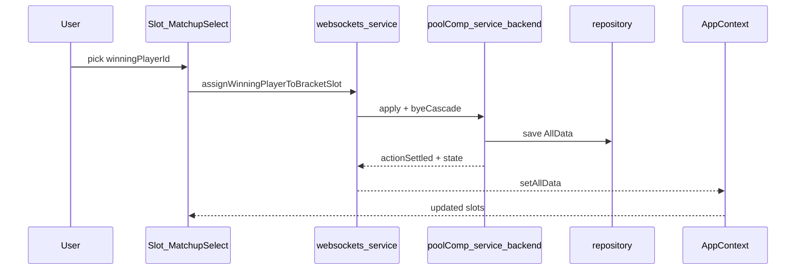

# View styling, global modals, Players redesign, bracket slot picker

## Current anchors

- [`frontend/src/components/ViewContainer/ViewContainer.tsx`](frontend/src/components/ViewContainer/ViewContainer.tsx) — `view-content` is already the sized container (`container-type: size`) with inset padding via [`frontend/src/components/ViewContainer/ViewContainer.scss`](frontend/src/components/ViewContainer/ViewContainer.scss) and [`frontend/src/mixins.scss`](frontend/src/mixins.scss) `cq-responsive`.
- “Black box” look comes from shared tokens [`$color-panel-bg` / `$color-panel-border`](frontend/src/variables.scss) on [`Players.scss`](frontend/src/views/Players/Players.scss), [`LandingPage.scss`](frontend/src/views/LandingPage/LandingPage.scss), [`CompHistory.scss`](frontend/src/views/History/CompHistory.scss), and modal shells in [`PlayerSelectModal.scss`](frontend/src/views/Comp/components/PlayerSelectModal.scss).
- Bracket tree indexing is already explicit in [`frontend/src/services/tournamentStructure.service.ts`](frontend/src/services/tournamentStructure.service.ts) (parent `sN` → children `s(2N)` and `s(2N+1)`), which matches connector math.
- [`SlotPlayerSelectModal.tsx`](frontend/src/views/Comp/components/TournamentStructure/components/SlotPlayerSelectModal.tsx) currently mirrors modal markup but **does not assign** a player on click (buttons have no handlers).

## 1) Visual system: pool-table–aligned content (no heavy black panels)

**Goal:** Keep the pool table as the primary surface; view chrome should read like Comp’s fields (light / felt-adjacent) rather than `#1c1c1c` cards.

- Introduce a small set of **view-surface** variables (or reuse [`$color-comp-field-*`](frontend/src/variables.scss) where appropriate) for: subtle border, translucent or light background, and readable text on felt.
- Update SCSS for [`player-view`](frontend/src/views/Players/Players.scss), [`home-view`](frontend/src/views/LandingPage/LandingPage.scss), [`history-view`](frontend/src/views/History/CompHistory.scss) to drop the solid `$color-panel-bg` slab; use nested structure matching the DOM per [`.cursor/rules/frontend/sass-file-organisation.mdc`](.cursor/rules/frontend/sass-file-organisation.mdc).
- **Orientation layouts:** mirror [`Comp.scss`](frontend/src/views/Comp/Comp.scss) patterns using `.is-portrait &` / `.is-landscape &` on the view root (orientation class already applied on [`App.tsx`](frontend/src/App.tsx) `app-container`).
- **Scaling:** prefer `@include cq-responsive(( gap: …, padding: …, font-size: … ))` for spacing and typography on these views’ roots (same pattern as `view-content` in ViewContainer).
- **Rules cleanup:** replace `data-variant="primary"` on [`LandingPage.tsx`](frontend/src/views/LandingPage/LandingPage.tsx) with a class (workspace rule: no `data-*` for styling). Replace `data-selected` on modal/grid buttons with a class such as `.is-selected` in [`PlayerSelectModal.tsx`](frontend/src/views/Comp/components/PlayerSelectModal.tsx) (and any new modal content).

**Small bugfix (optional but cheap while touching History):** [`CompHistory.scss`](frontend/src/views/History/CompHistory.scss) defines `.history-item` but the markup uses `<history-item>` — align selector with the custom element.

## 2) Domain + Mongo + backend: `deactivated` players and slot assignment

### Player model

- Extend [`shared/domain.ts`](shared/domain.ts) `Player` with `deactivated: boolean` (default `false` in code paths).
- [`backend/src/mongo/repository.ts`](backend/src/mongo/repository.ts): when mapping documents, treat missing `deactivated` as `false` so existing DB rows keep working.

### API changes ([`shared/messageToBackend.ts`](shared/messageToBackend.ts))

- **Remove** `removePlayer` from `BackendApi` (and delete the handler) **or** keep internally unused — simplest is remove end-to-end with the UI.
- **Add** `deactivatePlayer: { playerId: string }` (or `setPlayerDeactivated: { playerId: string; deactivated: boolean }` if you want reactivation later; your description only needs deactivate).
- **Add** bracket message, e.g. `assignWinningPlayerToBracketSlot: { parentSlotId: string; winningPlayerId: string }` (names can be tuned; payload matches your requirement: target slot + chosen player).

### Backend service ([`backend/src/services/poolComp.service.ts`](backend/src/services/poolComp.service.ts))

- **`deactivatePlayer`:** set `deactivated: true` on the player; if there is an **unstarted** active comp and they are registered, remove them from `registeredPlayers` and rebuild pre-start slots via existing `generateSlots` (same as current `removePlayer` branch for unstarted comps). If comp is **started**, allow deactivation but do not rewrite historical slot `playerId` values (names still resolve for the bracket).
- **`togglePlayerInActivePoolComp` / `addPlayer`:** reject registering or creating duplicates in ways you already validate; additionally **reject registering deactivated players**.
- **`assignWinningPlayerToBracketSlot`:** validate: active comp exists, `started === true`, parent slot exists and `kind === "empty"`, parse `N` from `sN`, load children `s(2N)` and `s(2N+1)`, verify `winningPlayerId` equals the `playerId` of **one** child with `kind === "player"` (BYE auto-handling below reduces when this is needed).
- **BYE auto-advance (your clarification):** add a pure helper, e.g. `applyAutomaticByeAdvances(slots): Slot[]`, called:
  - at the end of `startActivePoolComp` after `buildStartedSlots`, and
  - after each successful `assignWinningPlayerToBracketSlot`,
  - iterating until stable: for each internal `empty` parent, if children are `(player, bye)` or `(bye, player)` in either order, set parent to `{ kind: "player", playerId: … }`; define behavior for `(bye, bye)` if your generator can emit it (likely set parent `bye` or leave empty — implement the minimal consistent rule and comment it).

Frontend [`frontend/src/services/poolComp.service.ts`](frontend/src/services/poolComp.service.ts): add send helpers for the new messages; remove `removePlayer` helper if dropped from API.

## 3) Global modal: component + service + App root

**Constraints:** no classes ([`.cursor/rules/coding-style.mdc`](.cursor/rules/coding-style.mdc)) — use a factory for the modal controller; function components as `export function Name()`.

- Add [`frontend/src/components/Modal/Modal.tsx`](frontend/src/components/Modal/Modal.tsx) (and `Modal.scss`): shared `app-modal-overlay` + `app-modal` shell (backdrop click to close, keyboard escape optional if you want parity), using the new lighter surface tokens.
- Add [`frontend/src/services/modal.service.ts`](frontend/src/services/modal.service.ts) exporting a factory such as `createModalController()` returning `{ getState, subscribe, open, close }` with a small subscriber pattern, **or** (simpler integration) define modal state in [`AppContext.tsx`](frontend/src/AppContext.tsx) and keep `modal.service.ts` as thin helpers / type definitions only. Recommended: **AppContext state** for `modal: null | { kind: …; … }` plus `openModal` / `closeModal` to avoid extra `useSyncExternalStore` unless you prefer it.
- Render the shell once in [`App.tsx`](frontend/src/App.tsx) **inside** `ViewContainer`’s tree is not required — modals should likely sit at `app-content` level **above** `ViewContainer` **or** as a portal covering the viewport; simplest is a sibling after `Header` with `position: fixed` overlay so it is not clipped by `view-content`. Place `<ModalHost />` next to `ViewContainer` under `app-content` and style overlay `position: fixed; inset: 0; z-index: …`.
- Refactor [`PlayerSelectModal.tsx`](frontend/src/views/Comp/components/PlayerSelectModal.tsx) into content-only (e.g. `SelectRegisteredPlayersContent`) that receives `close` and uses `togglePlayerInActivePoolComp`; [`Comp.tsx`](frontend/src/views/Comp/Comp.tsx) calls `openModal({ kind: "selectRegisteredPlayers" })` instead of local `useState` + dedicated modal component import.
- Move shared modal styles out of `PlayerSelectModal.scss` into `Modal.scss`; delete or shrink view-local modal SCSS accordingly.

## 4) Players view: grid, filter, detail panel/modal, save + deactivate

- **Grid:** replace vertical-only list with a responsive CSS grid (columns via `cq-responsive` / orientation blocks) of name tiles; **default filter** hides `deactivated === true` players. Add a labeled control (checkbox) “Show deactivated players” to reveal them (wording can match your UX).
- **Selection:** clicking a tile opens global modal (same `ModalHost`) with title **Update player**, read-only **Player ID**, editable **Name**, bottom actions:
  - **Close**
  - **Save** disabled until name differs from server state and passes trim/non-empty rules; on click call existing `updatePlayer` message ([`shared/messageToBackend.ts`](shared/messageToBackend.ts)).
  - **Deactivate player** calls new `deactivatePlayer` message; then `closeModal`.
- **Add player row:** keep at top; layout follows orientation blocks.
- **AppContext:** expose `deactivatePlayer` from service; remove `removePlayer` from context value if API removed.

## 5) Bracket slot UI: rename, anchor, service helpers, wiring

- **Rename** `SlotPlayerSelectModal` → something like `SlotMatchupPlayerSelect` (no “Modal”); file move under the same folder or `TournamentStructure/components/`.
- **Behavior:**
  - Only open for **`empty` internal** slots after start (leaves are already `player`/`bye`). Optionally ignore clicks on non-empty slots unless you later add “change winner”.
  - Compute feeder slot ids in [`frontend/src/services/poolComp.service.ts`](frontend/src/services/poolComp.service.ts) as pure functions (e.g. `calculateFeederSlotIdsForParentSlot`, `listWinningPlayerChoicesForParentSlot`) using the same `s(2N)`/`s(2N+1)` rule as [`tournamentStructure.service.ts`](frontend/src/services/tournamentStructure.service.ts).
  - **Player vs player:** render an absolutely positioned panel inside [`tournament-structure-inner`](frontend/src/views/Comp/components/TournamentStructure/TournamentStructure.scss) (already `position: relative`) aligned to the clicked slot (pass slot ref or `SlotWithPosition` geometry to position with the same `cqw`/`cqh` coordinates plus a small offset).
  - **Click outside:** `mousedown`/`pointerdown` on `document` or overlay sibling, excluding the panel element, to dismiss (same feel as modal).
  - On pick: send `assignWinningPlayerToBracketSlot`; backend applies + BYE cascade; websocket snapshot updates [`AppContext`](frontend/src/AppContext.tsx); [`Slot.tsx`](frontend/src/views/Comp/components/TournamentStructure/components/Slot.tsx) re-renders label from `players`.
- **Remove** dependency on `player-modal-overlay` styling for this control; give it its own compact surface styles (still consistent with new modal tokens).

## 6) Files likely touched (concise)

| Area                 | Files                                                                                                                                                                                                                                       |
| -------------------- | ------------------------------------------------------------------------------------------------------------------------------------------------------------------------------------------------------------------------------------------- |
| Shared API/types     | [`shared/domain.ts`](shared/domain.ts), [`shared/messageToBackend.ts`](shared/messageToBackend.ts)                                                                                                                                          |
| Backend              | [`backend/src/services/poolComp.service.ts`](backend/src/services/poolComp.service.ts), [`backend/src/mongo/repository.ts`](backend/src/mongo/repository.ts)                                                                                |
| Modal infra          | new `frontend/src/components/Modal/*`, [`frontend/src/App.tsx`](frontend/src/App.tsx), [`frontend/src/AppContext.tsx`](frontend/src/AppContext.tsx), new `frontend/src/services/modal.service.ts` (or context-only)                         |
| Comp registration UI | [`frontend/src/views/Comp/Comp.tsx`](frontend/src/views/Comp/Comp.tsx), refactor modal content from [`PlayerSelectModal.tsx`](frontend/src/views/Comp/components/PlayerSelectModal.tsx)                                                     |
| Bracket              | [`TournamentStructure.tsx`](frontend/src/views/Comp/components/TournamentStructure/TournamentStructure.tsx), rename/replace slot picker component, [`frontend/src/services/poolComp.service.ts`](frontend/src/services/poolComp.service.ts) |
| Views / theme        | [`Players.tsx`](frontend/src/views/Players/Players.tsx), [`Players.scss`](frontend/src/views/Players/Players.scss), [`LandingPage.*`](frontend/src/views/LandingPage/), [`CompHistory.*`](frontend/src/views/History/)                      |

## Testing / verification

- Run backend + frontend, create comp, start comp: confirm BYE paths auto-fill parents without manual picks.
- Pick a player-vs-player internal slot: popover shows two names; choice persists after refresh (Mongo).
- Deactivate player: disappears from default Players grid; cannot toggle into registration; unstarted registration updates if they were registered.
- Modals: backdrop dismiss; Comp “Add Players” uses global host; styling matches new surfaces.
