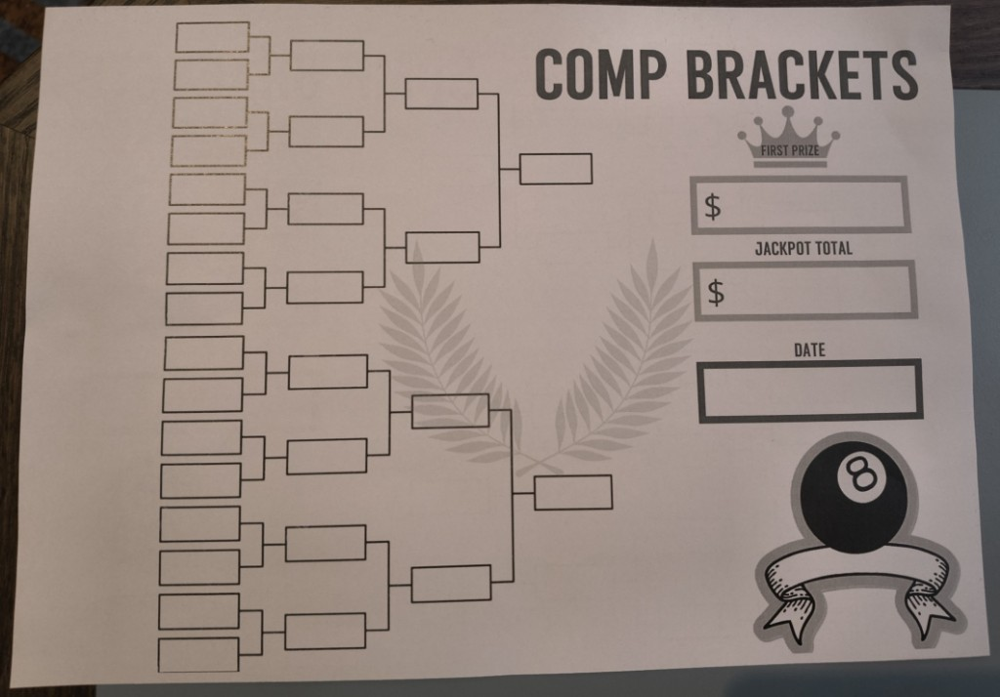

# Bracket mirror

The tournament UI shows a digital representation of the paper bracket. The comp manager keeps paper and app aligned **manually** (who is in the draw, starting the comp, completing it).

## How it should work

- The comp manager runs the bracket on paper as valid games are played.
- The app shows the same structure on screen so people can follow along without crowding the paper.
- Updates to entrant lists and comp lifecycle happen through explicit actions in the app, not by photographing the sheet.

## Guiding constraints

- The paper bracket remains the authority for disputes.
- The digital view is optional convenience.
- The viewer reflects backend state; it does not replace the paper record.

## Relates to

- [Philosophy](philosophy.md) — paper stays as source of truth, the app mirrors it for convenience.
- [Backend](backend.md) — holds canonical state for the active comp and broadcasts it via WebSocket.
- [Player Registry](player-registry.md) — players must exist in the registry before they can be added to the active comp in prep.